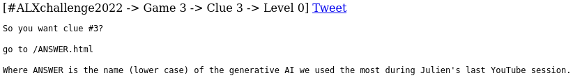

How you can solve for Game 3 of the \#ALXchallenge2022
---

This twitter feed came up, I was stuck at level 23 by the time I saw this 

So as we can see from the tweet, the clue can be found some where inside the domain `venicodivici.co`

### Level 0

The first thing that came up when I clicked on the link was 



If you have been following [Julien](https://www.youtube.com/@0xJulien) for anytime now, you would immediately realize that he did a live stream called [`Live: Let's play with DALL-E 2, Midjourney 4 & Nijijourney`](https://www.youtube.com/watch?v=idbJhEdJI2w)

The first answer that came to was `Midjourney`, on entering the answer according to the format specified, you get [`http://venicodivici.co/midjourney.html`](http://venicodivici.co/midjourney.html), which led me to level 1

### Level 1


`10011101 << 3`, at first I copied this directly into a javascript console and got `80088808`, until I realized the first operand was binary not decimal so I prepended `0b` to tell **JS**, `10011101` is binary, after I made the correction I got the following result

```js
> 0b10011101 << 3
1256
```

So our endpoint for entering level 2 becomes: [`http://venicodivici.co/1256.html` ](http://venicodivici.co/1256.html)

### Level 2


A quick google search of the question will give the answer: `Guido van Rossum`
Our next endpoint: [`http://venicodivici.co/guido.html` ](http://venicodivici.co/guido.html)

### Level 3


I like vim, but I don't hate emacs, but I wanted to go to the next level, so I prepended `view-source:` before the url inside the address bar


As we can see from the image above, `#teamVim` links to the passage itself, and `/teamEmacs.html` takes us to the next level.

Our next endpoint: [`http://venicodivici.co/teamEmacs.html` ](http://venicodivici.co/teamEmacs.html)

### Level 4


After downloading the [crackme](http://www.venicodivici.com/crackmeclue3), we conduct some basic static and dynamic analysis to understand how it works

**Static Analysis**

Check all the strings inside crackme for potential password, the following are some of the interesting strings,

```sh
$ strings crackmeclue3  
...
libc.so.6
puts
...
strcmp
...
vimisbetH
terthaneH
macs
...
OK :)
Try again
...
GCC: (Ubuntu 9.4.0-1ubuntu1~20.04.1) 9.4.0
...
main2.c
...
puts@@GLIBC_2.2.5
...
strcmp@@GLIBC_2.2.5
...
main
...
```

We can see the shared object `libc.so`, some functions that seem to be utilized are `puts`, to return strings to the standard input and  `strcmp` , to compare two strings. The message on failure `Try again` and the message on success `OK :)`. We can also see the type of compiler and system used `GCC: (Ubuntu 9.4.0-1ubuntu1~20.04.1) 9.4.0` and some strings that seem to say `vimisbetterthanemacs`, which could be our pasword

We give the crackme permissions to be executable

```sh
$ chmod u+x crackmeclue3
```
So testing our potential password

	$ ./crackmeclue3 vimisbetterthanemacs
	Try again

Let's go deeper and see if we can get further than this, so let's use `xxd` which is hexdump tool (and we also use `less` here to keep the terminal as clean as possible)

	$ xxd crackmeclue3 | less
	...
	000011a0: 2528 0000 0048 8945 f831 c048 b876 696d  %(...H.E.1.H.vim
	000011b0: 6973 6265 7448 ba74 6572 7468 616e 6548  isbetH.terthaneH
	000011c0: 8945 e048 8955 e8c7 45f0 6d61 6373 c645  .E.H.U..E.macs.E
	000011d0: f400 c645 e577 c645 e66f c645 e772 c645  ...E.w.E.o.E.r.E
	000011e0: e873 c645 e974 c645 ea2e 837d dc02 752c  .s.E.t.E...}..u,
	...

Let's make sense of the result above, there are basically 3 columns, the left column indicates the file offset of the row, the next two columns show the data in hex and as text respectively. At the offsets `000011a0`, `000011b0` and `000011c0`, we can see the text we found earlier, if we take a closer look at the offsets `000011d0` and `000011e0`, you can make out the letters `w`, `o`, `r`, `s`, `t` surrounded by `.E`, thus adding those characters to the our initial password we get `vimisbetterthanemacsworst`

```sh
$ ./crackmeclue3 vimisbetterthanemacsworst
Try again
```
**Dynamic Analysis**

By this time I decided to move on to the dynamic analysis, I initially tried `objdump` and `gdb`, but seeing as I was not going anywhere with it, I moved to a tool I had an opportunity to use in the past known as `frida`, which is a dynamic intrumentation toolkit, which allows you to hook into applications at runtime and tamper with functions, replace those functions with your custom functions and other fun stuff.

Install frida (you'll need python and pip installed for this)

```sh
$ sudo pip install frida-tools
```

Among some of the tools that come prepackaged with `frida`, one of the tools is called `frida-trace` which allows you to trace functions, see there arguments (depending on the function of course). So let's trace the functions inside our crackme

After navigating to the directory we have our crackme

```sh
$ frida-trace ./crackmeclue3 thismaybethepassword -i strcmp
```

We are using `frida-trace` to run `crackmeclue3` with the argument `thismaybethepassword` as our password and we are using `-i` flag to include the function `strcmp` to trace (we are assuming here that `strcmp` is used to check if the password is actually correct) and we get the following


`frida-trace` first generates a handler if the `strcmp` function is found and the handler by default logs what the arguments are and how long it took to trace the function, it took `90ms` on my machine and we can also see the string I passed as a password and the string it compared it (which is the actual password we want) and the error message `Try again` since we passed in an incorrect password

```sh
$ ./crackmeclue3 vimisworst.thanemacs
OK :)
```

Since we have successfully cracked the crackme, our next endpoint becomes: [`http://venicodivici.co/vimisworst.thanemacs.html` ](http://venicodivici.co/vimisworst.thanemacs.html)

### Level 5


When I first saw this, I initially thought it was morse code, but a quick google search shows that there's an actual language named Brainfuck. Luckilly, I found an [online decder](https://www.dcode.fr/brainfuck-language), which translated this gibberish to plaintext


Our next endpoint: [`http://venicodivici.co/57364n0.html` ](http://venicodivici.co/57364n0.html)

### Level 6


When this page came up there wasn't anything else except for the [image](http://venicodivici.co/images/img.png) and a quick inspection of the tweet button shows

	
	...
	Status: There is only an image? [Game 3 -> Clue 3 -> Level 6] ...

So I thought there must be something inside the image, and started looking for steganography related tools and I stumbled upon **`binwalk`** while I was reading this [article](https://infosecwriteups.com/beginners-ctf-guide-finding-hidden-data-in-images-e3be9e34ae0d), which helps in identifying if files are embedded inside other files in our case an image. fortunately the tool came with my linux distribution, so I didn't have to install it

```sh
$ binwalk img.png
```

	DECIMAL       HEXADECIMAL     DESCRIPTION
	--------------------------------------------------------------------------------
	0             0x0             PNG image, 1024 x 1024, 8-bit/color RGB, non-interlaced
	41            0x29            Zlib compressed data, default compression
	1573270       0x180196        Zip archive data, at least v1.0 to extract, name: nextlevel/
	1573338       0x1801DA        Zip archive data, at least v1.0 to extract, compressed size: 20, uncompressed size: 20, name: nextlevel/url.txt
	1573600       0x1802E0        End of Zip archive, footer length: 22

We can see at the hexa file offset location `0x1801DA`,  there's a path inside `nextlevel/url.txt` that could lead us to the next level.
So we use the `-e` flag to extract the embedded data using `binwalk`

```sh
	$ binwalk -e img.png
```

After extracting the files a new directory is generated with the name of the img, `_img.png.extracted`, navigating inside we can find the path: `nextlevel/url.txt` inside. The `url.txt` contains the following text: `/identification.php`

My friend [Nati M Dessie](https://twitter.com/NManyazewal), told me you can also use `strings`, which achieves the same result:

```sh
	$ strings img.png
	...
	nextlevel/UT
	nextlevel/url.txtUT
	/identification.php
	nextlevel/UT
	nextlevel/url.txtUT
```

Our next endpoint: [`http://venicodivici.co/identification.php` ](http://venicodivici.co/identification.php)

### Level 7


I tried some random username of `test` and password  of `test` to see if it would log me in, and this page came up


I tried a few username password combinations and I just slept on the problem. The next day I realized when there is a login form, it means the form system is potentially vulnerable to **SQL Injection** attacks

I first tried the single quote chatacter `'` only on the username field and this page came up


After attempting different sql injection codes that came to my mind, I got bored and a day or so later I asked [Julien](https://twitter.com/julienbarbier42) wanting to know if the level was over (I assumed it was) and he responded as follows and it some what reinvigorated to keep on trying.


I went on google to find a list of sql injection payloads and I grabbed the first result that came up


The [SQL Injection Payload List](https://github.com/payloadbox/sql-injection-payload-list) repo had a list of differnet kinds of injection attacks

I copy the first list that was labeled `Generic SQL Injection Payloads` and save it to a file called `payloads-1.txt` in my working directory

I then use the network debugger inside developer tools to remake the request


```py
#!/usr/bin/python3
import asyncio
import aiohttp

# read the payloads file and store as a a list in
# the variable lines
with open('payloads-1.txt') as f:
    lines = f.readlines()

url = "http://venicodivici.co/identification.php"

headers = {
        "User-Agent": "Mozilla/5.0 (X11; Linux x86_64; rv:91.0) Gecko/20100101 Firefox/91.0",
        "Accept": "text/html,application/xhtml+xml,application/xml;q=0.9,image/webp,*/*;q=0.8",
        "Accept-Language": "en-US,en;q=0.5",
        "Content-Type": "application/x-www-form-urlencoded"
    }

def parse(content, left, right, li = 1, ri = 0):
    value = str(content.split(left)[li].split(right)[ri])
    return value

async def r(session, i):
    data = f"submitted=1&username=%{i}&password="
    async with session.post(url, headers = headers, data = data) as resp:
            res = await resp.text()
            print(f"{i} <>>> {res}")

async def main():
    l = []
    async with aiohttp.ClientSession() as session:
        for i in d:
            l.append(r(session, i))
        await asyncio.gather(*l)

asyncio.run(main())

```
